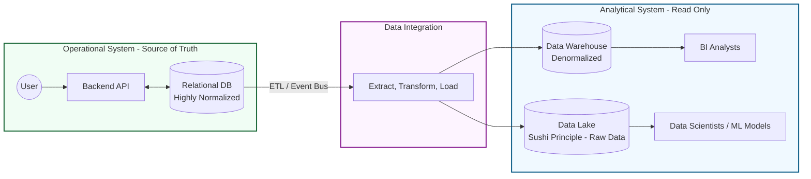
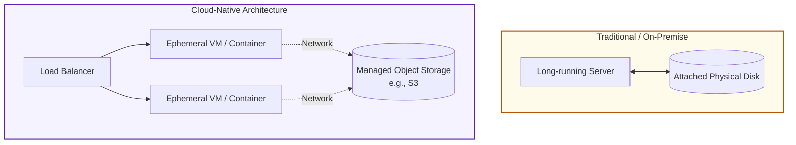
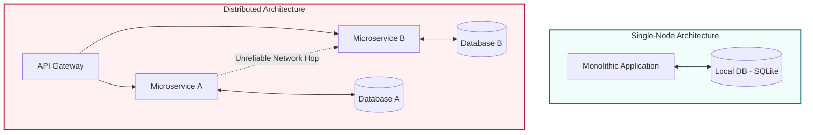

# Chapter 1

- [Trade-Offs in Data Systems Architecture](#trade-offs-in-data-systems-architecture)
   * [1.1 Operational vs. Analytical Systems](#11-operational-vs-analytical-systems)
      + [The Nature of Data-Intensive Apps](#the-nature-of-data-intensive-apps)
      + [OLTP (Operational) vs. OLAP (Analytical)](#oltp-operational-vs-olap-analytical)
      + [Machine Learning & Data Lakes](#machine-learning-data-lakes)
   * [1.2 Cloud Native vs. Self-Hosted Infrastructure](#12-cloud-native-vs-self-hosted-infrastructure)
      + [Infrastructure Choices](#infrastructure-choices)
      + [The Cloud Paradigm](#the-cloud-paradigm)
      + [DevOps & SRE Philosophy](#devops-sre-philosophy)
   * [1.3 Distributed vs. Single-Node Systems](#13-distributed-vs-single-node-systems)
      + [Single-Node Architecture](#single-node-architecture)
      + [Distributed Systems Concepts](#distributed-systems-concepts)
      + [The Challenges of Distribution](#the-challenges-of-distribution)
      + [Microservices, Serverless, and HPC](#microservices-serverless-and-hpc)
   * [1.4: Ethics, Privacy, and Legal Compliance](#14-ethics-privacy-and-legal-compliance)

# Trade-Offs in Data Systems Architecture

Core Theme: Designing data systems is about understanding trade-offs; many architectural questions lack a single "right" answer and instead present multiple possibilities with distinct pros and cons.

## 1.1 Operational vs. Analytical Systems
### The Nature of Data-Intensive Apps
Data-Intensive vs. Compute-Intensive: Data-intensive applications primarily struggle with data management (volume, complexity, speed). Compute-intensive applications struggle with the parallelization of CPU operations.

**Primary Challenges:** Systems must handle concurrent writes, maintain consistency during failures, and manage storage, processing, and high availability.

**Core Components:** Applications generally comprise a Database, an API, and "Glue" code. Specific data infrastructure includes:

**Databases**: The primary storage mechanism.

**Caches:** Used to remember results of expensive operations to speed up reads.

**Search Indexes:** Used for keyword search or filtering.

**Message Queues (MQs):** For asynchronous task handling.

**Stream Processing:** To handle events and data changes as soon as they occur.

**Batch Processing:** For the periodical processing of accumulated data.

**The Stateless App:** Modern apps are often stateless; when a request finishes, the app forgets it because it has no internal memory. All state is strictly stored in external databases.

### OLTP (Operational) vs. OLAP (Analytical)
**Operational Systems (OLTP):** User-facing systems comprised of backend services and data infrastructure.

Focused on CRUD operations (Create, Read, Update, Delete).

**Relies on Point Queries:** looking for a small number of records using a specific key or filter.

Acts as the System of Record (Source of Truth) holding highly normalized data.

**Analytical Systems (OLAP):** Company-facing systems used by BI analysts for massive aggregations.

Read-only and often operates in batches.

Uses Derived Data Systems (denormalized data pulled from the source of truth).

**Real-time Analytics:** For low-latency analytical queries, specialized tools like ClickHouse are used.

**The Separation:** Querying OLTP directly for analytics is highly undesirable because data is spread across multiple databases, data models aren't suited for aggregations, queries are computationally expensive, and the systems need network isolation.

**ETL/ELT:** The process of moving data from operational databases into a separate Data Warehouse for OLAP.

### Machine Learning & Data Lakes
**BI vs. ML:** Data warehouses store relational data (great for Business Intelligence, bad for Machine Learning).

**Data Layout for ML:** Databases are treated as vectors/matrices of numerics (features) for engineering, or NLP is applied to text. Python (Pandas, Scikit-learn) is favored over SQL, so relational DBs are rarely used.

**Data Lake:** Stores massive amounts of arbitrary data in object/file storage. It follows the "Sushi Principle"—raw, untransformed data is better for data scientists.

**Reverse ETL:** The process of moving derived insights from analytical systems back into operational systems.

## 1.2 Cloud Native vs. Self-Hosted Infrastructure
### Infrastructure Choices
**Rule of Thumb:** A core service providing a competitive advantage should be built in-house; non-core services should be outsourced to a vendor.

**On-Premises:** Physical hardware you directly control and maintain.

**Cloud-Native:** Architecture designed specifically for the cloud from the ground up for massive scalability (e.g., AWS Aurora, Google BigQuery).

**Self-Hosted Software:** Software you run yourself, whether on-prem or in the cloud (e.g., MySQL, ClickHouse, Spark).

### The Cloud Paradigm
**IaaS (Infrastructure as a Service):** Renting virtual machines (VMs).

**Separation of Compute and Storage:** Cloud systems build upon lower-level services. Compute VMs do the processing, but state is stored externally in services like Amazon S3.

**Virtual Disks:** Not real physical hardware attached to your machine, but a cloud service emulating a disk over the network.

**Multitenancy:** Cloud infrastructure is multitenant (one physical machine hosts many customers). It enables scalability but must be strictly managed to prevent interference between customers.

### DevOps & SRE Philosophy
**SRE:** Site Reliability Engineer (Google's term for DevOps).

**Core Philosophy:** A shift from managing individual bare-metal machines to managing overarching services.

**Priorities:**

- Automation over manual, one-off jobs.

- Using ephemeral (temporary) VMs rather than long-running servers.

- Enabling frequent, reliable application updates.

- Learning strictly from incidents and preserving organizational knowledge.

## 1.3 Distributed vs. Single-Node Systems
### Single-Node Architecture
**The Single-Node Advantage:** If possible, keep the system on a single machine. Performing tasks on a single node is substantially simpler, avoids network failures, and is highly reliable.

**Tools:** Single-node databases like SQLite, DuckDB, or KuzuDB are exceptionally powerful before distributed scale is required.

### Distributed Systems Concepts
**Inherent Distribution:** The moment two devices or users communicate over a network, the system is 100% distributed.

**Fault Tolerance / High Availability:** The application must continue running even if individual machines fail. This requires redundancy.

**Scalability:** Distributing the workload across multiple machines as load increases.

**Elasticity:** Dynamic provisioning (adding/removing) of machines on the fly to optimize hardware costs.

**Latency:** The physical need to place servers geographically close to the user.

### The Challenges of Distribution
**Unreliable Networks:** Requests sent over a network are inherently unreliable, slow (compared to local disk), and retrying failed requests is incredibly dangerous without idempotency.

**Distributed Consistency:** Monolithic databases natively provide ACID consistency. In a distributed microservice setup, maintaining data consistency becomes the application code's problem.

**Observability:** Troubleshooting distributed environments is highly complex. It requires robust data collection, querying, metrics, and distributed tracing (using tools like OpenTelemetry, Zipkin, or Jaeger).

### Microservices, Serverless, and HPC
**Microservices:** Evolved from Service-Oriented Architecture (SOA).

**Pros:** Independent updates, separate hardware resource allocation, encapsulated implementation hidden behind APIs (handled via OpenAPI / gRPC).

**Cons:** End-to-end testing is incredibly difficult, and maintaining strict API compatibility is burdensome. It is often a technical solution to an organizational/people problem.

**Serverless (FaaS):** Function as a Service. A cloud execution model with zero managed hardware/VMs. Automatically scales per request, bills only for exact execution time, but is constrained by hard time limits.

**Supercomputing (HPC):** High-Power Computing. Unlike standard cloud VMs, these are specialized supercomputers reserved for math-heavy tasks (weather forecasting, molecular dynamics, partial differential equations).

## 1.4: Ethics, Privacy, and Legal Compliance
**Legal Constraints:** A data system's architecture is shaped not just by scale, but by strict privacy regulations and compliance standards (e.g., PCI for credit cards, SOC2 for general security practices). Data localization laws may force EU data to stay in EU data centers.

**The Engineering Blindspot:** Engineers frequently view legal requirements as administrative annoyances rather than fundamental architectural constraints.

**Bias & Discrimination:** The collection and processing of data, especially when fed into ML models, carry inherent risks of encoding societal bias and discrimination.

**The Ultimate Challenge:** Translating abstract legal privacy requirements and individual human rights into the rigid, technical implementation of a distributed software system.
