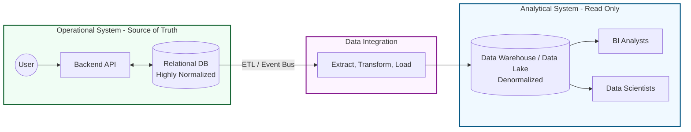
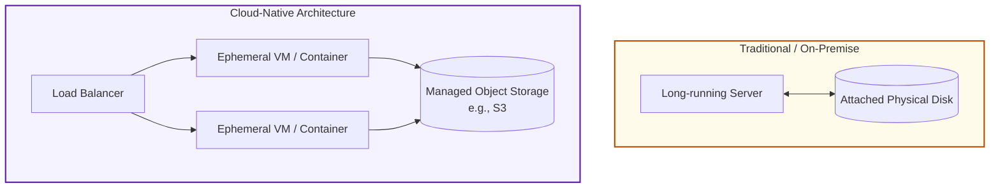
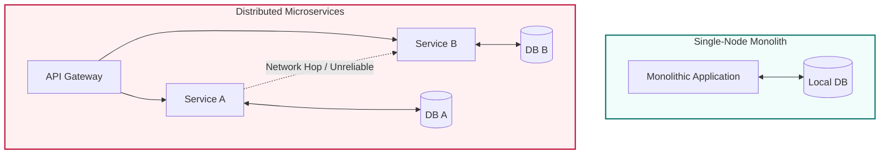

# Chapter 1

* [Trade-Offs in Data Systems Architecture](#trade-offs-in-data-systems-architecture)
  + [1.1 Operational (OLTP) vs. Analytical (OLAP) Systems](#11-operational-oltp-vs-analytical-olap-systems)
  + [1.2 Cloud Native vs. Self-Hosted Infrastructure](#12-cloud-native-vs-self-hosted-infrastructure)
  + [1.3 Distributed vs. Single-Node Systems](#13-distributed-vs-single-node-systems)
  + [1.4 Ethics, Privacy, and Legal Compliance](#14-ethics-privacy-and-legal-compliance)

## Trade-Offs in Data Systems Architecture

A core theme in designing data systems is understanding trade-offs; many architectural questions lack a single "right" answer and instead present multiple possibilities, each with distinct pros and cons.

### 1.1 Operational (OLTP) vs. Analytical (OLAP) Systems
Operational and analytical systems differ not only in the types of data they manage and their access patterns, but also in the audiences they serve.

Operational Systems (OLTP): User-facing systems designed for point queries, high-throughput concurrent writes, and CRUD operations. They act as the system of record (Source of Truth).

Analytical Systems (OLAP): Company-facing systems (used by BI analysts and data scientists) designed for aggregating large numbers of records. They are typically read-only.

Data Layouts: Because OLTP and OLAP systems serve fundamentally different types of queries, they often require significantly different internal data layouts. OLTP data is usually highly normalized to ensure write consistency, whereas OLAP data is denormalized (e.g., star schemas, columnar formats) to optimize expensive read aggregations.

Data Flow: Data feeds are moved from operational systems into data warehouses or data lakes via ETL (Extract, Transform, Load) or ELT processes.

Architectural Context: This separation of operational and analytical data is effectively a macro-level application of CQRS (Command Query Responsibility Segregation). An event-driven architecture often bridges this gap: as backend services execute commands and mutate the OLTP database (like PostgreSQL), domain events are published to an event bus or stream (like Kafka) to asynchronously hydrate the analytical data warehouse.

### 1.2 Cloud Native vs. Self-Hosted Infrastructure
The traditional paradigm of self-hosted software is increasingly being compared against modern cloud services.

Cost vs. Capability: Determining whether a cloud service or a self-hosted approach is more cost-effective depends heavily on your specific situation.

Architectural Shift: Cloud-native approaches are bringing massive changes to how data systems are architected. A primary example is the deliberate separation of storage and compute.

DevOps/SRE Philosophy: Managing this infrastructure shifts focus from configuring long-running, bare-metal servers to automating ephemeral VMs and utilizing managed resources (e.g., relying on S3 for object storage rather than managing physical disks).

### 1.3 Distributed vs. Single-Node Systems
Cloud systems are intrinsically distributed. While modern cloud-native apps default to microservices and serverless architectures, distribution introduces significant complexity.

The Single-Node Advantage: It is advisable not to rush into making a system distributed if it is possible to keep it on a single machine. Performing tasks on a single node is substantially simpler and more reliable.

Microservices Trade-offs: Breaking a monolith into microservices or distributed orchestrators introduces network latency, unreliability, and the challenge of distributed transactions. A well-structured Vertical Slice Architecture on a single, heavily provisioned node can often outperform a poorly bounded distributed system by avoiding network hops entirely.

When to Distribute: Distribution becomes unavoidable when a system requires inherent network communication, fault tolerance/redundancy, massive scalability, or geographically low latency.

### 1.4 Ethics, Privacy, and Legal Compliance
A data system's architecture is shaped by business needs as well as privacy regulations that protect the rights of the people whose data is processed.

The Engineering Blindspot: Engineers are often prone to ignoring these legal requirements.

Balancing Needs: It is critical to balance the needs of the business against the needs and rights of the individuals whose data is being collected and processed.

Implementation Challenges: How to perfectly translate legal privacy requirements into technical software implementations has not yet been formalized, but it remains a crucial consideration for any system architecture.

Would you like to dive deeper into the specific data layouts mentioned for OLAP systems, or explore strategies for handling distributed transactions when a single-node architecture is no longer feasible?
